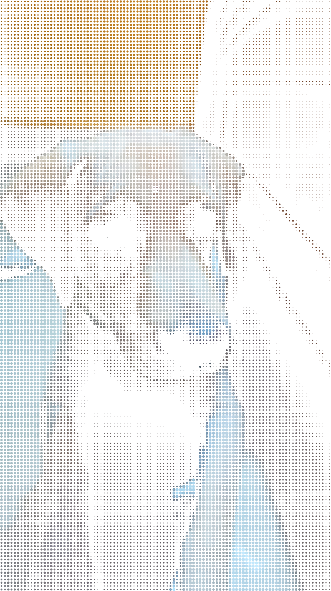
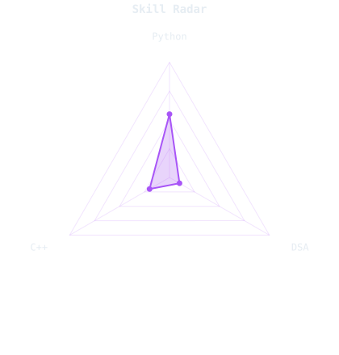
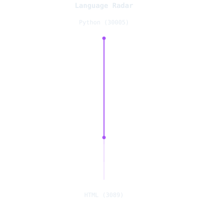
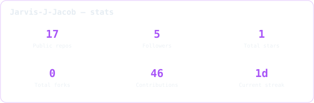

<picture>
  <source media="(prefers-color-scheme: dark)" srcset="assets/portrait.svg">
  <source media="(prefers-color-scheme: light)" srcset="assets/portrait.svg">
  
</picture>

 

## log 001 — who's writing this

Hi, I'm **Jarvis**. I'm a student at Newton School of Technology, S-VYASA campus, currently spending most of my time getting better at building things and understanding how they work underneath.

- Currently building **[your latest project]()**
- Competitive programming on **[Codeforces](https://codeforces.com/profile/3jz)**
- Learning **Contributing to OpenSource Projects**
- Fun fact: **My Real name is truly Jarvis**

toolbox

 

## log 002 — skill radar, two ways

One I rated myself. One is counted straight from repo bytes and can't be argued with.

<table><tr>
<td width="50%" align="center">
  <picture>
    <source media="(prefers-color-scheme: dark)" srcset="assets/radar-dark.svg">
    <source media="(prefers-color-scheme: light)" srcset="assets/radar-light.svg">
    
  </picture>
</td>
<td width="50%" align="center">
  <picture>
    <source media="(prefers-color-scheme: dark)" srcset="assets/radar-langs-dark.svg">
    <source media="(prefers-color-scheme: light)" srcset="assets/radar-langs-light.svg">
    
  </picture>
</td>
</tr></table>

 

## log 003 — the year, and a snake that ate it

<picture>
  <source media="(prefers-color-scheme: dark)" srcset="https://raw.githubusercontent.com/Jarvis-J-Jacob/Jarvis-J-Jacob/output/snake-dark.svg">
  <source media="(prefers-color-scheme: light)" srcset="https://raw.githubusercontent.com/Jarvis-J-Jacob/Jarvis-J-Jacob/output/snake-light.svg">
  
</picture>

<picture>
  <source media="(prefers-color-scheme: dark)" srcset="assets/metrics.plugin.svg">
  <source media="(prefers-color-scheme: light)" srcset="assets/metrics.plugin.svg">
  
</picture>

the snake link 404s until the snake workflow has run once — expected on day one, not a bug.

 

## log 004 — stats, self-hosted so they don't 503

<picture>
  <source media="(prefers-color-scheme: dark)" srcset="assets/card-stats-dark.svg">
  <source media="(prefers-color-scheme: light)" srcset="assets/card-stats-light.svg">
  
</picture>

  

## log 005 — four things worth a look

<table><tr>
<td width="50%">
  <a href="https://github.com/Jarvis-J-Jacob/PROJECT_ONE">
    <picture>
      <source media="(prefers-color-scheme: dark)" srcset="assets/card-project_one-dark.svg">
      <source media="(prefers-color-scheme: light)" srcset="assets/card-project_one-light.svg">
      
    </picture>
  </a>
</td>
<td width="50%">
  <a href="https://github.com/Jarvis-J-Jacob/PROJECT_TWO">
    <picture>
      <source media="(prefers-color-scheme: dark)" srcset="assets/card-project_two-dark.svg">
      <source media="(prefers-color-scheme: light)" srcset="assets/card-project_two-light.svg">
      
    </picture>
  </a>
</td>
</tr><tr>
<td width="50%">
  <a href="https://github.com/Jarvis-J-Jacob/PROJECT_THREE">
    <picture>
      <source media="(prefers-color-scheme: dark)" srcset="assets/card-project_three-dark.svg">
      <source media="(prefers-color-scheme: light)" srcset="assets/card-project_three-light.svg">
      
    </picture>
  </a>
</td>
<td width="50%">
  <a href="https://github.com/Jarvis-J-Jacob/PROJECT_FOUR">
    <picture>
      <source media="(prefers-color-scheme: dark)" srcset="assets/card-project_four-dark.svg">
      <source media="(prefers-color-scheme: light)" srcset="assets/card-project_four-light.svg">
      
    </picture>
  </a>
</td>
</tr></table>

| Project | Stack | Link |
|---|---|---|
| PROJECT_ONE | — | [repo](https://github.com/Jarvis-J-Jacob/PROJECT_ONE) |
| PROJECT_TWO | — | [repo](https://github.com/Jarvis-J-Jacob/PROJECT_TWO) |
| PROJECT_THREE | — | [repo](https://github.com/Jarvis-J-Jacob/PROJECT_THREE) |
| PROJECT_FOUR | — | [repo](https://github.com/Jarvis-J-Jacob/PROJECT_FOUR) |

 

everything above regenerates itself on a schedule — nothing here is hand-updated

