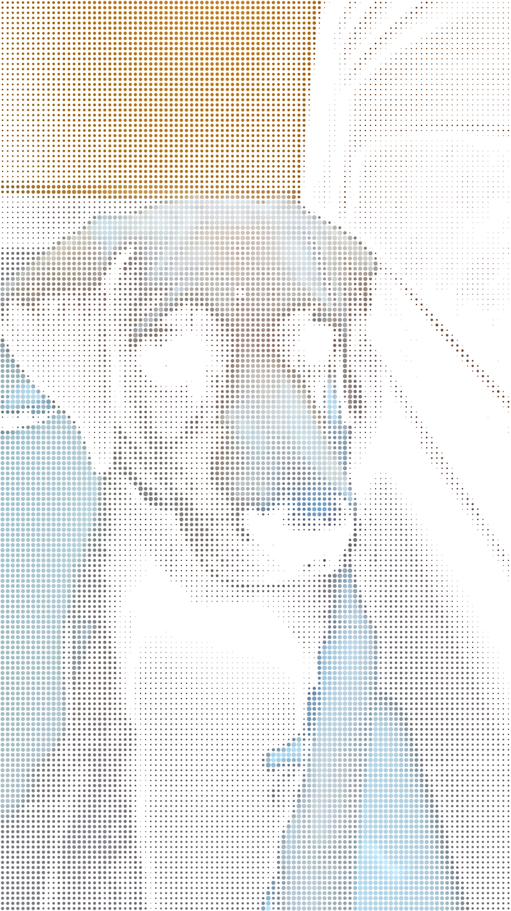
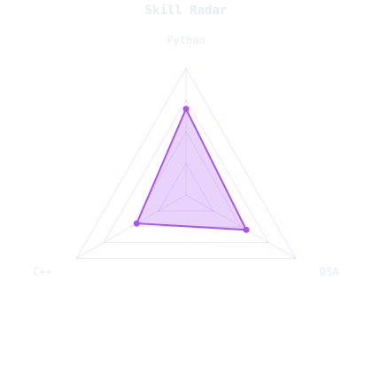
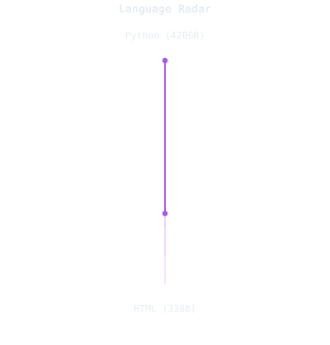
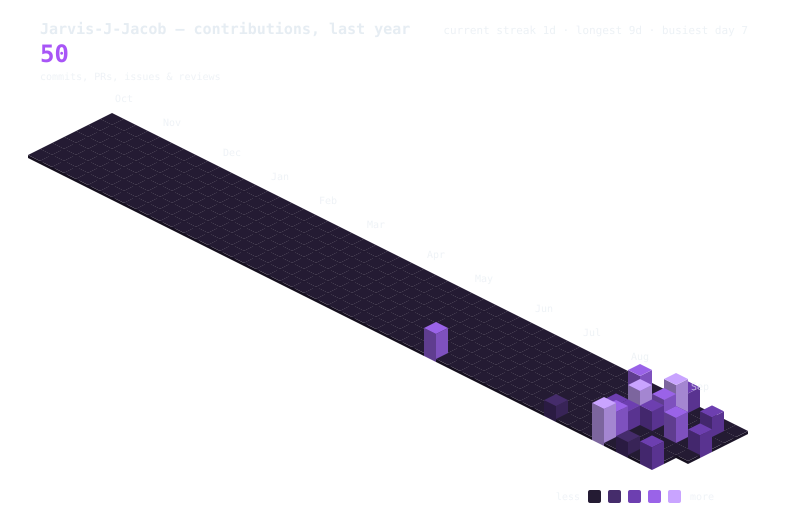

<picture>
  
</picture>

# Jarvis Jeason Jacob

Student at Newton School of Technology (S-VYASA campus) · open-source contributor

 

## About

I'm a CS student who learns by reading real codebases and sending fixes upstream. Right now I'm working toward
Google Summer of Code, focusing on a small number of projects rather than many.

- Contributing to: **openSUSE / Open Build Service** (Ruby on Rails), plus tooling and test work in Python projects
- Competitive programming on [Codeforces](https://codeforces.com/profile/3jz)
- I disclose AI assistance wherever a project's policy asks for it, and I only submit code I can explain myself

## Selected contributions

| Project | ★ | What | Status |
|---|--:|---|---|
| [graphify](https://github.com/Graphify-Labs/graphify/pulls?q=is%3Apr+author%3AJarvis-J-Jacob) | 124k | Extraction tests (Zig, C#, Kotlin) | ✅ Shipped in v0.9.77 |
| [open-build-service](https://github.com/openSUSE/open-build-service/pulls?q=is%3Apr+author%3AJarvis-J-Jacob) | 1.1k | Fix 500 in `public#binary_packages` for scmsync packages | 🔄 In review |
| [career-ops](https://github.com/career-ops-hq/career-ops/pulls?q=is%3Apr+author%3AJarvis-J-Jacob) | 74k | Docs: path-resolver module | 🔄 In review |
| [DevForge](https://github.com/NST-DEVFORGE/DevForge/pulls?q=is%3Apr+author%3AJarvis-J-Jacob) | 17 | `next/image` for navbar logo | ✅ Merged |

<!-- Re-add after verifying the links and merge status:
     TheAlgorithms/Python, blokkaDev/cluster -->

## Skills

<table><tr>
<td width="50%" align="center">
  <picture>
    <source media="(prefers-color-scheme: dark)" srcset="assets/radar-dark.svg">
    <source media="(prefers-color-scheme: light)" srcset="assets/radar-light.svg">
    
  </picture>
</td>
<td width="50%" align="center">
  <picture>
    <source media="(prefers-color-scheme: dark)" srcset="assets/radar-langs-dark.svg">
    <source media="(prefers-color-scheme: light)" srcset="assets/radar-langs-light.svg">
    
  </picture>
</td>
</tr></table>

## Activity

<picture>
  <source media="(prefers-color-scheme: dark)" srcset="assets/isocal-dark.svg">
  <source media="(prefers-color-scheme: light)" srcset="assets/isocal-light.svg">
  
</picture>

<picture>
  <source media="(prefers-color-scheme: dark)" srcset="https://raw.githubusercontent.com/Jarvis-J-Jacob/Jarvis-J-Jacob/output/snake-dark.svg">
  <source media="(prefers-color-scheme: light)" srcset="https://raw.githubusercontent.com/Jarvis-J-Jacob/Jarvis-J-Jacob/output/snake-light.svg">
  
</picture>

The calendar and snake are generated from GitHub's own data by workflows in this repo.

