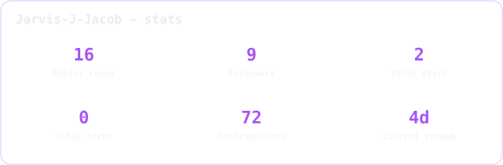

<picture>
  <source media="(prefers-color-scheme: dark)" srcset="assets/portrait.svg">
  <source media="(prefers-color-scheme: light)" srcset="assets/portrait.svg">
  
</picture>

 

## `~/` whoami

Hi, I'm **Jarvis**. I'm a student at Newton School of Technology, S-VYASA campus, currently spending most of my time getting better at building things and understanding how they work underneath.

- Not building anything public yet — right now my reps are open-source PRs, not my own repos
- Competitive programming on **[Codeforces](https://codeforces.com/profile/3jz)**
- Learning **Contributing to OpenSource Projects**
- Fun fact: **My Real name is truly Jarvis**

## `~/` toolbox

 

## `~/` skill radar

One I rated myself. The other counts real language bytes across my public repos and redraws itself on a schedule.

<table><tr>
<td width="50%" align="center">
  <picture>
    <source media="(prefers-color-scheme: dark)" srcset="assets/radar-dark.svg">
    <source media="(prefers-color-scheme: light)" srcset="assets/radar-light.svg">
    
  </picture>
</td>
<td width="50%" align="center">
  <picture>
    <source media="(prefers-color-scheme: dark)" srcset="assets/radar-langs-dark.svg">
    <source media="(prefers-color-scheme: light)" srcset="assets/radar-langs-light.svg">
    
  </picture>
</td>
</tr></table>

 

## `~/` contribution calendar

<picture>
  <source media="(prefers-color-scheme: dark)" srcset="assets/isocal-dark.svg">
  <source media="(prefers-color-scheme: light)" srcset="assets/isocal-light.svg">
  
</picture>

  

<picture>
  <source media="(prefers-color-scheme: dark)" srcset="https://raw.githubusercontent.com/Jarvis-J-Jacob/Jarvis-J-Jacob/output/snake-dark.svg">
  <source media="(prefers-color-scheme: light)" srcset="https://raw.githubusercontent.com/Jarvis-J-Jacob/Jarvis-J-Jacob/output/snake-light.svg">
  
</picture>

both self-drawn from GitHub's own data, no third-party server: the calendar by <code>scripts/isocal.py</code> on every push (and daily), the snake by its workflow on every push (and twice daily). They 404 only until the first run.

 

## `~/` the numbers

This tracks activity, not ownership — so it's accurate even before there's a single repo of my own.

<picture>
  <source media="(prefers-color-scheme: dark)" srcset="assets/card-stats-dark.svg">
  <source media="(prefers-color-scheme: light)" srcset="assets/card-stats-light.svg">
  
</picture>

  

## `~/` selected contributions

Merged pull requests in other people's repos. Every link goes to the PR.

| Project | What I shipped |
|---|---|
| **[blokkaDev/cluster](https://github.com/blokkaDev/cluster)** ★5 lightweight cluster system, Python CLI | 7 merged PRs: [colored CLI output](https://github.com/blokkaDev/cluster/pull/15), a [`version` command](https://github.com/blokkaDev/cluster/pull/17), [config validation](https://github.com/blokkaDev/cluster/pull/20), [CLI tests](https://github.com/blokkaDev/cluster/pull/18), [clearer errors when the Manager is unreachable](https://github.com/blokkaDev/cluster/pull/19), a fix for a [duplicate `POST /connect/{worker_id}` request](https://github.com/blokkaDev/cluster/pull/14), and [review follow-ups](https://github.com/blokkaDev/cluster/pull/16) |
| **[pradipNP/khelzon](https://github.com/pradipNP/khelzon)** ★1 browser arcade, HTML/CSS/JS | [Request-a-Game form in the footer](https://github.com/pradipNP/khelzon/pull/45), [PNG app icons for the PWA manifest](https://github.com/pradipNP/khelzon/pull/44), [labels on the header toolbar buttons](https://github.com/pradipNP/khelzon/pull/13) |
| **[NST-DEVFORGE/DevForge](https://github.com/NST-DEVFORGE/DevForge)** ★17 | [`next/image` for the navbar logo](https://github.com/NST-DEVFORGE/DevForge/pull/164) |
| **[dhhhhruv/campuskart](https://github.com/dhhhhruv/campuskart)** Flask student marketplace | [Fixed the newsletter success flag being set unconditionally](https://github.com/dhhhhruv/campuskart/pull/128) |
| **[michaelegner/architecture-intelligence-platform](https://github.com/michaelegner/architecture-intelligence-platform)** ★7 | [Worked `curl` example for the A5 blast-radius docs](https://github.com/michaelegner/architecture-intelligence-platform/pull/43) |
| **[TheAlgorithms/Python](https://github.com/TheAlgorithms/Python)** ★225k | Docstrings for [`prompt()`](https://github.com/TheAlgorithms/Python/pull/15092) and [`build_tree()`](https://github.com/TheAlgorithms/Python/pull/15091) |

**In review right now:** [career-ops docs](https://github.com/career-ops-hq/career-ops/pull/4809) · [open-build-service: fix a 500 in `public#binary_packages`](https://github.com/openSUSE/open-build-service/pulls?q=author%3AJarvis-J-Jacob) · [career-centre](https://github.com/HopLittleBunny/career-centre/pulls?q=author%3AJarvis-J-Jacob) (docs, test and fixture PRs)

first steps: [first-contributions](https://github.com/firstcontributions/first-contributions/pull/123910) · [our-dev-wall](https://github.com/ssagar1999/our-dev-wall/pull/7)

 

## `~/` first project

Nothing to show here yet — everything I've written so far has gone into other people's repos as pull requests, not my own. This section is reserved for the first thing I ship on my own, and it'll show up here automatically the day I do.

 

everything above regenerates itself on a schedule — nothing here is hand-updated

